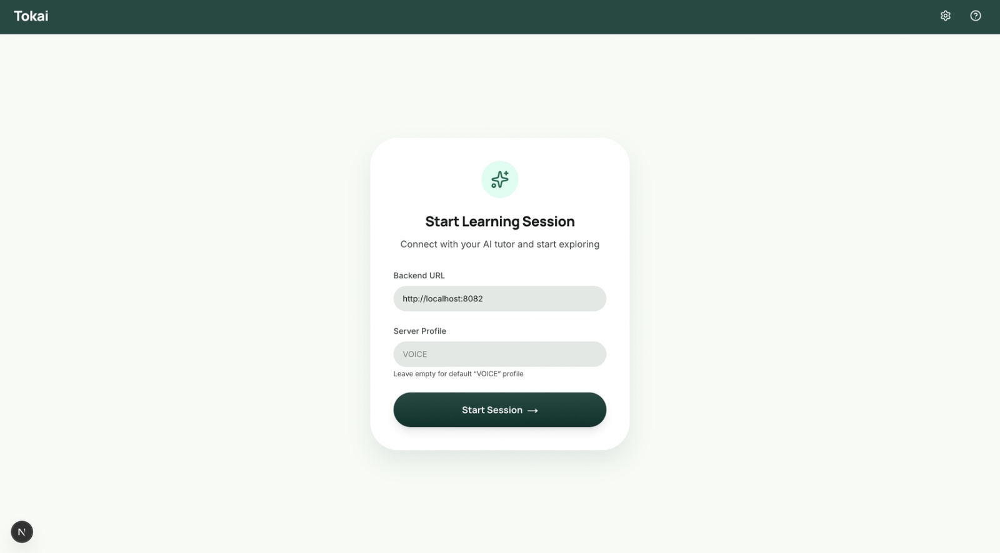
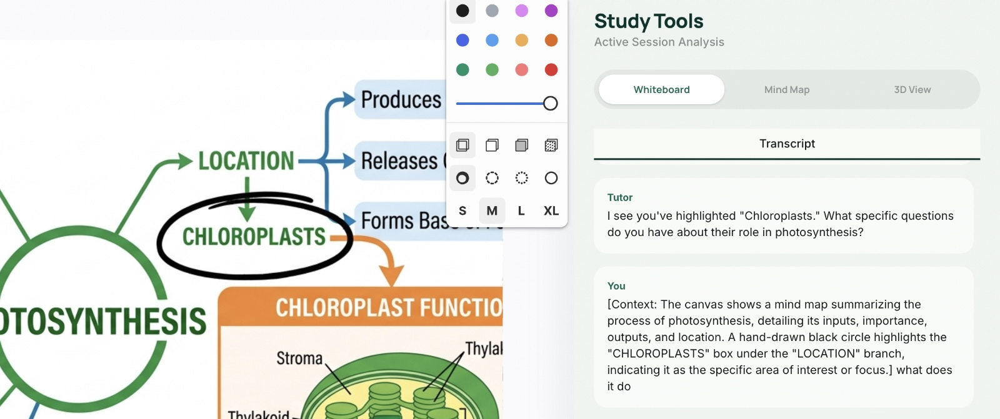
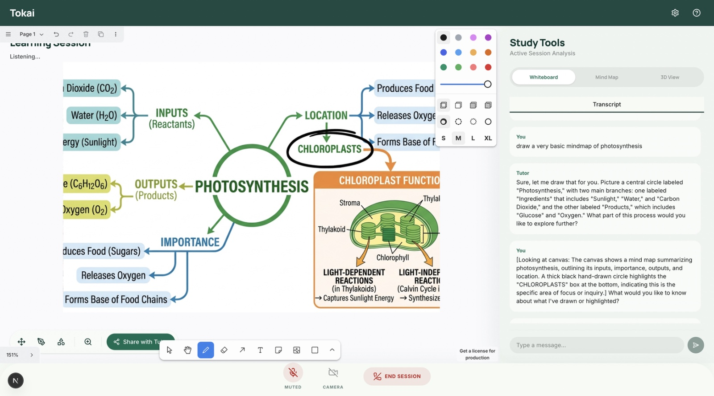

# Tokai — AI Tutoring Platform

> *Where every student gets a brilliant tutor who draws, listens, and adapts in real time.*

Tokai is an accessibility-first AI tutoring platform powered by Agora Conversational AI and Gemini. A Socratic voice tutor teaches on a live whiteboard, understands hand gestures, and builds a visual concept map as the lesson unfolds — giving every student the experience of a one-on-one private tutor.

Built at the **Agora Voice AI Hackathon Singapore 2026**.

---
## Demo


https://github.com/user-attachments/assets/c5897f19-ef43-4a84-9f00-4c4dcc1c9c78


## Screenshots

**Onboarding — connect your AI tutor and start a session**



**Gesture-controlled annotation — circle concepts on the whiteboard using hand gestures**



> *Annotation made using gestures*

**AI explanation — the tutor responds to questions about what's on the whiteboard**



---

## What It Does

The student opens a browser, presses **Start Session**, and begins talking. The AI tutor:

- **Teaches on a live whiteboard** — draws diagrams, labels, and arrows in real time as it explains concepts
- **Listens and responds** — voice-to-voice conversation with sub-second latency via Agora Conversational AI
- **Understands gestures** — students circle, point at, or highlight areas on the whiteboard using hand gestures; the tutor reads the annotation and responds to it
- **Builds a concept map** — a live mind map in the sidebar grows incrementally as new concepts are introduced, showing how ideas connect
- **Displays 3D models** — the tutor triggers floating 3D visualizations (solar system, DNA helix, human heart) for subjects that benefit from spatial understanding
- **Generates flashcards** — key facts are turned into review cards automatically during the session
- **Summarises the session** — a markdown summary is produced at the end

---

## The Problem It Solves

Quality one-on-one tutoring is expensive and inaccessible for most students. Tokai makes the Socratic teaching method — asking questions, drawing on a board, adapting to confusion in real time — available to anyone with a browser. The gesture input layer means students can interact naturally without typing or clicking, keeping focus on learning.

---

## How We Built It

### Architecture

```
Browser (Next.js frontend)
  ↕ Agora RTC — voice audio
  ↕ Agora RTM — transcript stream
  ↕ WebSocket — tool results (drawings, flashcards, mind map, 3D models)
Agora Conversational AI Engine (Cloud)
  ↕ STT → Custom LLM Server → TTS
Custom LLM Server (Python / Flask)
  → Gemini 3 Flash with tool-calling
  → Broadcasts tool results to frontend via WebSocket
Gesture Server (Python / MediaPipe)
  → Detects hand gestures via webcam
  → Sends gesture events to frontend WebSocket
```

### Custom LLM Tools

The Gemini-powered tutor has access to a suite of whiteboard and UI tools:

| Tool | What It Does |
|---|---|
| `draw_shapes` | Draws on the tldraw whiteboard (arrows, labels, diagrams) |
| `generate_flashcards` | Creates review flashcards from lesson content |
| `update_mind_map` | Builds a live concept map in the sidebar (nodes + edges, merge/replace mode) |
| `show_3d_visualization` | Opens a floating Three.js model viewer |
| `generate_session_summary` | Produces a markdown lesson summary |

### Gesture Recognition

A Python server runs MediaPipe hand tracking via webcam. Recognised gestures:

- **Index finger draw** — freehand annotation on the whiteboard
- **Pinch** — zoom in on the 3D model viewer
- **Swipe** — rotate the 3D model viewer
- **Open palm** — signals confusion; the tutor marks the current concept as a "question" node in the mind map (amber highlight)

### Mind Map Panel

The concept map uses `@xyflow/react` (React Flow v12) with `@dagrejs/dagre` for automatic left-to-right layout. Node types — `root`, `concept`, `detail`, `question` — are colour-coded. The map grows incrementally as the tutor introduces new ideas and resets when the topic changes.

### 3D Visualization

A floating, draggable Three.js r170 panel renders GLB models. The tutor triggers it via the `show_3d_visualization` tool and can highlight specific parts (e.g. `["earth", "jupiter"]`). Students interact using OrbitControls or gestures.

---

## Tech Stack

| Layer | Technology |
|---|---|
| Frontend | Next.js 16, React 19, Tailwind v4, tldraw |
| Voice pipeline | Agora RTC SDK, Agora RTM, Agora Conversational AI Engine |
| LLM | Gemini 3 Flash (Custom LLM Server, OpenAI-compatible format) |
| Gesture recognition | Python, MediaPipe, asyncio WebSockets |
| Mind map | @xyflow/react v12, @dagrejs/dagre |
| 3D models | Three.js r170, GLTFLoader, OrbitControls |
| Backend | Python Flask |
| TTS | Rime (voice: Astra) |
| ASR | Agora Ares (en-US) |

---

## Running Locally

### Prerequisites

- Node.js 20+
- Python 3.11+
- Agora App ID + App Certificate ([Agora Console](https://console.agora.io))
- Gemini API key
- Rime TTS API key

### Start the servers

```bash
# 1. Simple backend (token gen + agent start/stop)
cd simple-backend
python3 -m venv venv && source venv/bin/activate
pip install -r requirements-local.txt
cp .env.example .env   # fill in your keys
python local_server.py

# 2. Custom LLM server (Gemini proxy + WebSocket broadcast)
cd custom-llm-server
pip install -r requirements.txt
python server.py

# 3. Gesture server (MediaPipe hand tracking)
cd gesture-server
pip install -r requirements.txt
python app.py

# 4. Frontend
cd frontend
npm install
npm run dev
```

Open [http://localhost:3000](http://localhost:3000), enter your backend URL, and press **Start Session**.

---

## Hackathon

**Agora Voice AI Hackathon Singapore 2026**
- Venue: Carousell Campus
- Date: Friday, April 10, 2026
- Submission: [ConvoAI Club](https://www.convoai.club/library/a1b2c3d4-e5f6-4a7b-8c9d-0e1f2a3b4c5d)

Required technologies used: **Agora RTC SDK** + **Agora Conversational AI Engine**

---

## Team

Built by team Tokai at the Agora Voice AI Hackathon Singapore 2026.
